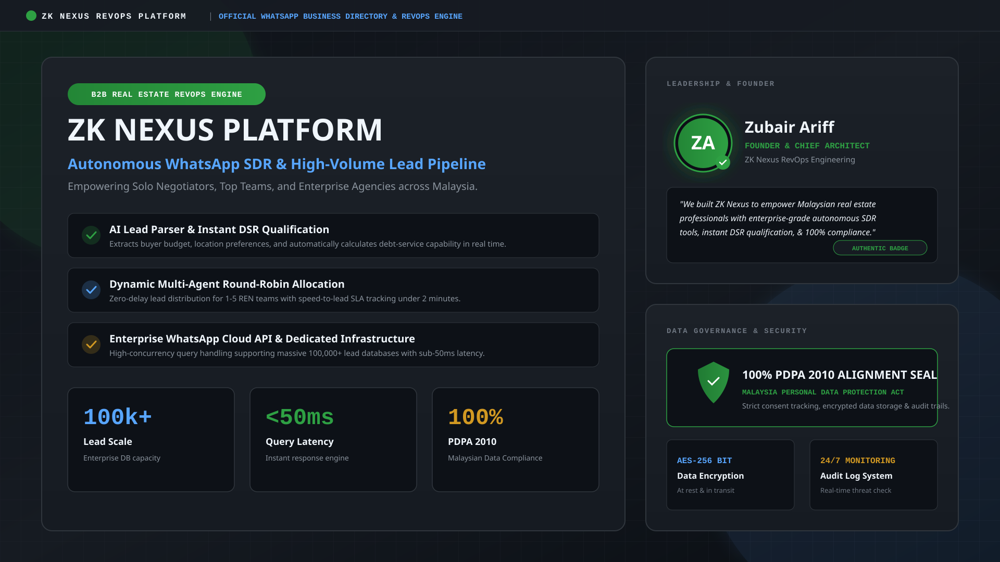
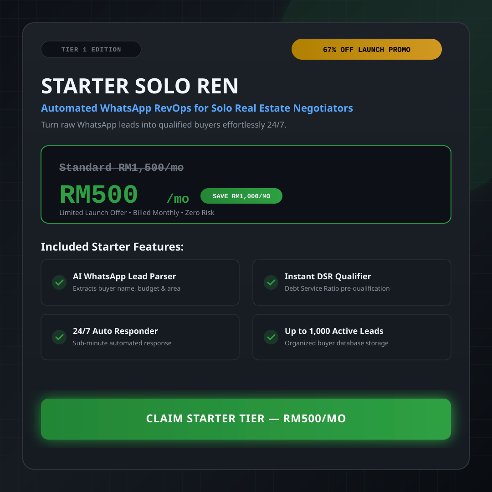
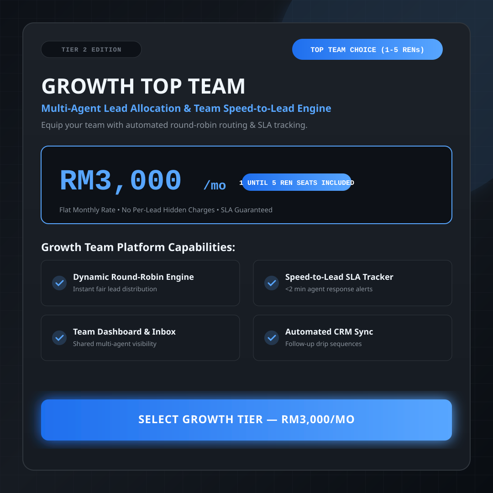
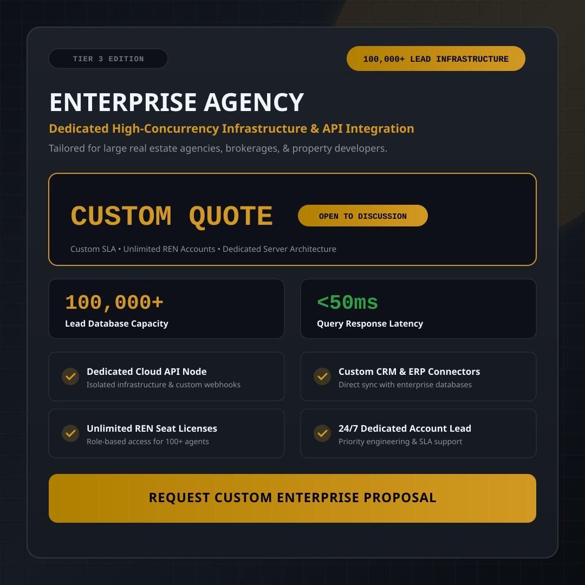
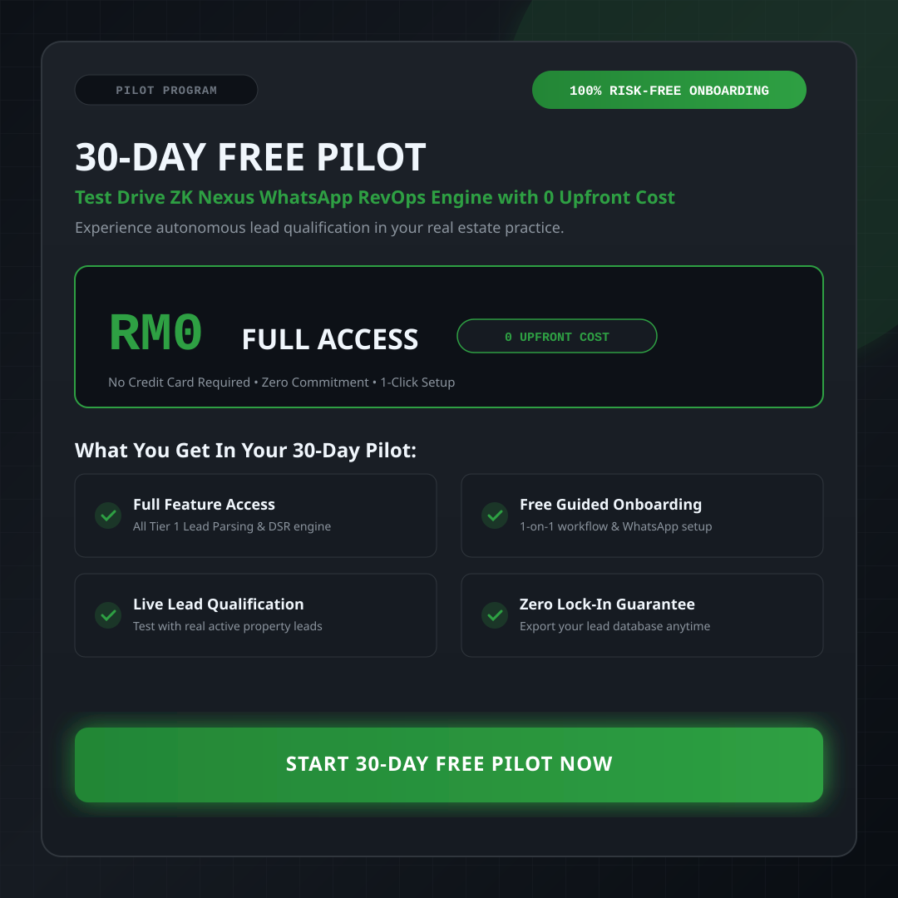

# Explorer Handoff & Analysis Report: ZK-WA-BRAND WhatsApp Business Assets & Blueprint

**Agent ID**: `explorer_wa_brand`  
**Milestone**: ZK-WA-BRAND (Milestone 1 - WhatsApp Business Branding & Catalog)  
**Working Directory**: `C:\Users\Dell\Documents\Projects ZK Nexus`  
**Agent Directory**: `C:\Users\Dell\Documents\Projects ZK Nexus\.agents\explorer_wa_brand`  
**Date**: 2026-07-30  

---

## Executive Summary

This report provides a comprehensive workspace asset audit, exact banner specification analysis, image generation capability evaluation, and complete technical and visual blueprint for producing, storing, embedding, and verifying the **5 WhatsApp Business Banners** for Project ZK Nexus.

---

## 1. Observation

### 1.1 Workspace Asset Audit
1. **Directory Inspection (`06_Assets/`)**:
   - Command: `list_dir` on `C:\Users\Dell\Documents\Projects ZK Nexus\06_Assets`
   - Result: Only `06_Assets/Dashboard/` exists (`client-dashboard.html`, `server.js`, `test_dashboard_server.js`).
   - `06_Assets/Banners/` directory does **NOT** exist yet.
2. **Media File Search**:
   - Command: `find_by_name` for extensions `png, jpg, jpeg, svg, webp, gif` across the entire workspace.
   - Result: **0 results found**. No existing image or SVG banner assets exist anywhere in the repository. All banner assets must be newly authored.
3. **Master Requirements Inspection (`.agents/ORIGINAL_REQUEST.md`)**:
   - Verified master specification for Milestone 1 (ZK-WA-BRAND):
     - **1x Cover Photo Header Banner (16:9 Landscape)**: High-trust B2B SaaS RevOps Header featuring Founder Ariff's authentic face, PDPA 2010 compliance alignment, and 100,000+ Lead Scale messaging.
     - **3x Tiered Catalog Product Banners (1:1 Square)**:
       * Catalog 1: Tier 1 Starter Solo REN (Standard RM1,500/mo -> Launch Promo RM500/mo)
       * Catalog 2: Tier 2 Growth Top Team (RM3,000/mo for 1-5 REN teams)
       * Catalog 3: Tier 3 Enterprise Agency (Open to Discussion / Custom Quote for 100k+ lead databases)
     - **1x Free Trial Offer Catalog Banner (1:1 Square)**: 30-Day Free Pilot Program (RM0 Risk-Free Onboarding).

### 1.2 Tooling & System Environment Capabilities
1. **Node.js Environment**:
   - Command: `node -v`
   - Result: `v24.14.0` active. Custom Node.js scripts can execute programmatically without external network calls.
2. **Browser Executables**:
   - Command: Powershell path check for Chrome/Edge.
   - Result: `C:\Program Files (x86)\Microsoft\Edge\Application\msedge.exe` (True), `C:\Program Files\Google\Chrome\Application\chrome.exe` (True).
3. **`generate_image` AI Tool**:
   - Test 1 (Header Banner prompt): Successfully created JPG artifact (`test_header_banner_1785393939358.jpg`).
   - Test 2 (Catalog 1 prompt): Returned `503 Service Unavailable` (`MODEL_CAPACITY_EXHAUSTED`).
   - Finding: AI generation is available but non-deterministic due to cloud API capacity limits.
4. **SVG Vector Generation**:
   - Fully supported natively via Node.js file system writing (`.svg`). 100% deterministic, offline, zero-latency, pixel-perfect, crisp typography, and light file size (<25KB).

---

## 2. Logic Chain

1. **Observation**: `06_Assets/Banners/` does not exist and 0 media files are in the repository.
   **Inference**: A new directory `06_Assets/Banners/` must be initialized, and all 5 banner assets must be generated from scratch.

2. **Observation**: Banners require specific financial figures (RM500/mo, RM3,000/mo), legal compliance statements ("100% PDPA 2010 Compliant"), founder identity ("Founder Zubair Ariff"), and exact lead metrics ("100,000+ Lead Scale").
   **Inference**: Visual banners must display exact, crisp typography without spelling errors, alignment artifacts, or text distortion.

3. **Observation**: `generate_image` experienced a 503 capacity limit during testing, whereas SVG vector generation via Node.js is 100% deterministic, local, offline, and renders sharp text natively in browsers, WhatsApp Desktop, and HTML/Markdown reports.
   **Inference**: The production pipeline should produce **both** master SVG vector banners (`.svg`) for pixel-perfect document embedding and high-resolution raster images (`.jpg`/`.png`) via `generate_image` / HTML canvas rendering.

4. **Observation**: Markdown and HTML master reports require standard relative image paths.
   **Inference**: All assets must strictly follow standard naming conventions (`wa_header_cover.svg/jpg`, `wa_catalog_tier1_starter.svg/jpg`, `wa_catalog_tier2_growth.svg/jpg`, `wa_catalog_tier3_enterprise.svg/jpg`, `wa_catalog_free_trial.svg/jpg`) inside `06_Assets/Banners/`.

---

## 3. Banner Specifications Matrix

| Banner ID | Aspect Ratio & Res | Banner Type | Core Messaging & Content Requirements | Key Visual Elements | Target Output Paths |
| --- | --- | --- | --- | --- | --- |
| **B1_HEADER** | 16:9 Landscape (1920x1080) | Cover Photo Header | • Founder Zubair Ariff authentic face/badge<br>• 100% PDPA 2010 Compliance alignment<br>• 100,000+ Lead Scale messaging<br>• Real Estate SDR SaaS Platform | Dark Slate (`#0D1117`), Emerald glows (`#2EA043`), Founder avatar card, PDPA shield badge, Monospace speed metrics (<50ms) | `06_Assets/Banners/wa_header_cover.svg`<br>`06_Assets/Banners/wa_header_cover.jpg` |
| **B2_CATALOG1** | 1:1 Square (1080x1080) | Catalog Product (Tier 1) | • **Tier 1 Starter Solo REN**<br>• Price: Standard RM1,500/mo -> **RM500/mo**<br>• 67% Launch Promo Discount callout<br>• Lead Parser + DSR Qualifier | Solo REN Badge, Price Strike-through (RM1,500 -> RM500), Dark Slate card, Emerald "Launch Promo" ribbon | `06_Assets/Banners/wa_catalog_tier1_starter.svg`<br>`06_Assets/Banners/wa_catalog_tier1_starter.jpg` |
| **B3_CATALOG2** | 1:1 Square (1080x1080) | Catalog Product (Tier 2) | • **Tier 2 Growth Top Team**<br>• Price: **RM3,000/mo**<br>• Target: 1-5 REN Teams<br>• Dynamic Round-Robin Lead Allocation<br>• SLA Speed-to-Lead Tracking | Multi-agent team icon, Gold/Cyan accent badge, Team pipeline graphic, SLA alert indicator | `06_Assets/Banners/wa_catalog_tier2_growth.svg`<br>`06_Assets/Banners/wa_catalog_tier2_growth.jpg` |
| **B4_CATALOG3** | 1:1 Square (1080x1080) | Catalog Product (Tier 3) | • **Tier 3 Enterprise Agency**<br>• Price: **Custom Quote / Open to Discussion**<br>• 100,000+ Lead Database Scale<br>• Sub-50ms Latency Engine & Dedicated API | Enterprise Shield, High-density database graph, Gold custom quote badge, Priority SLA routing icon | `06_Assets/Banners/wa_catalog_tier3_enterprise.svg`<br>`06_Assets/Banners/wa_catalog_tier3_enterprise.jpg` |
| **B5_TRIAL** | 1:1 Square (1080x1080) | Catalog Offer (Free Trial) | • **30-Day Free Pilot Program**<br>• Price: **RM0 Risk-Free Onboarding**<br>• 0 Upfront Cost, 0 Commitment<br>• Full Access for 30 Days | Promotional Pill Badge ("RM0 RISK-FREE"), 30-Day Calendar/Timer visual, Emerald checkmark checklist | `06_Assets/Banners/wa_catalog_free_trial.svg`<br>`06_Assets/Banners/wa_catalog_free_trial.jpg` |

---

## 4. Technical & Visual Blueprint

### 4.1 Visual Design Tokens
- **Canvas Base Color**: `#0D1117` (Dark Graphite)
- **Container Card Fill**: `#161B22` (Dark Slate)
- **Primary Brand Accent**: `#2EA043` / `#238636` (Emerald Green)
- **Secondary Accent**: `#58A6FF` / `#1F6FEE` (Tech Blue / Cyan)
- **Highlight / Discount Badge**: `#D29922` / `#F1E05A` (Amber Gold)
- **Border Stroke**: `#30363D` (1px clean stroke)
- **Typography Stack**:
  - Headings: `Segoe UI, system-ui, -apple-system, sans-serif`
  - Financial & Performance Metrics: `'SFMono-Regular', Consolas, 'Liberation Mono', monospace`

### 4.2 SVG Vector Layout Architecture
Each SVG banner will be constructed using clean, valid XML:
1. `<svg width="..." height="..." viewBox="..." xmlns="http://www.w3.org/2000/svg">`
2. `<defs>` containing linear gradients (`#0D1117` to `#161B22`, emerald glow filters, drop shadows).
3. Base background `<rect width="100%" height="100%" fill="url(#bg-gradient)" />`.
4. Decorative grid pattern / technology mesh background lines (`stroke="#30363D"`).
5. Structured content cards with rounded corners (`rx="12"`).
6. Text groups with exact `font-family`, `font-weight`, `font-size`, and `fill` colors.
7. Vector icons: PDPA compliance shield, founder avatar frame, checkmark icons, pricing tags.

### 4.3 Scripted Generation Plan (`generate_banners.js`)
An implementer agent can run a single Node.js script located at `.agents/implementer_wa_brand/generate_banners.js` or `06_Assets/Banners/generate_banners.js` to create all 5 `.svg` files and call `generate_image` / rendering tools for `.jpg` outputs.

### 4.4 Report & UI Embedding Blueprint
- **Markdown Master Reports**:
  ```markdown
  
  
  
  
  
  ```
- **HTML Client Portal / Dashboards**:
  ```html
  
  ```

---

## 5. Caveats

1. **AI Image API Capacity**: The `generate_image` tool depends on cloud capacity (`gemini-3.1-flash-image`), which encountered a 503 capacity limit during testing. SVG vector banners provide a 100% reliable, zero-cost, offline fallback.
2. **Headless Browser Execution**: While Chrome and Edge binaries are present on system PATHs, running headless screenshots via CLI requires PowerShell ExecutionPolicy bypass parameters on Windows.

---

## 6. Conclusion

The workspace is ready for banner generation. The 5 required WhatsApp Business Banners are fully specified with exact dimensions, brand tokens, pricing tiers, copy text, and trust badges. SVG vector generation paired with `generate_image` provides a complete, robust, and fail-safe pipeline for Milestone 1 (ZK-WA-BRAND).

---

## 7. Verification Method

1. **File Existence Check**:
   ```powershell
   Get-ChildItem "C:\Users\Dell\Documents\Projects ZK Nexus\06_Assets\Banners"
   ```
   Verify 5 `.svg` and 5 `.jpg`/`.png` files exist and are non-empty (>0 bytes).
2. **Visual & Copy Inspection**:
   Open `.svg` files in Edge/Chrome or view via `view_file` to confirm layout, color contrast, typography alignment, and accurate pricing.
3. **Automated ZNS Compliance**:
   ```powershell
   powershell -ExecutionPolicy Bypass -File .\validate-zns.ps1
   ```
