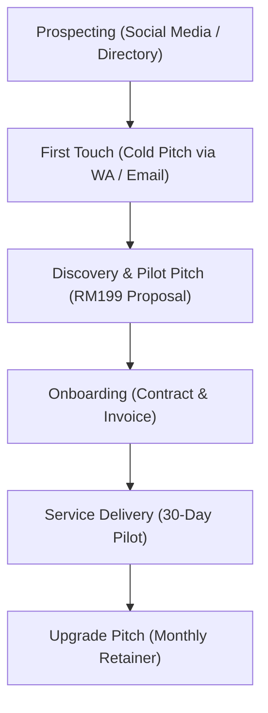

# ZK Revenue Ops Sales Process

This document outlines the sales process and customer acquisition funnel for ZK Revenue Ops to sign property agents (REN) as clients.

---

## 1. Funnel Stages

---

## 2. Step-by-Step Sales Workflow

### Step 1: Prospecting & Lead Generation
* **Activity:** Compile a database of property agents in Malaysia from:
  - Property portals (iProperty, PropertyGuru, EdgeProp).
  - Social media platforms (Facebook, Instagram, LinkedIn).
  - Property agency websites.
* **Criteria:** Focus on active agents who post properties regularly but show signs of slow follow-up (e.g. slow response on comments or listings).

### Step 2: First Outreach (Touch 1)
* **Activity:** Send cold WhatsApp outreach or cold email using the outreach templates ([TMP-002](file:///c:/Users/Dell/Documents/Projects%20ZK%20Nexus/07_Templates/Email/TMP-002_Email_SDR-Outreach.md)).
* **Focus:** Highlight a specific pain point: *"Property leads going cold."* Offer a free value audit or pitch the RM 199 30-Day Pilot immediately.

### Step 3: Proposal & Pilot Closing
* **Activity:** 
  - Send the personalized proposal using the Proposal Template ([TMP-001](file:///c:/Users/Dell/Documents/Projects%20ZK%20Nexus/07_Templates/Proposal/TMP-001_Proposal_SDR-Pilot.md)).
  - Answer objections regarding lead privacy and process control.

### Step 4: Client Onboarding
* **Activity:** 
  - Execute onboarding protocol ([SOP-002](file:///c:/Users/Dell/Documents/Projects%20ZK%20Nexus/01_Business/ZK-Revenue-Ops/Operations/client-onboarding.txt)).
  - Collect MSA (Master Service Agreement) and SOW (Statement of Work).
  - Collect setup payment.
  - Set up their dedicated client folder structure.

### Step 5: Pilot Execution & Retainer Pitch
* **Activity:**
  - Execute 30-day lead qualification campaign.
  - On Day 25, compile a conversion report (touch counts, revived leads, scheduled viewings, est. commission).
  - Schedule a review meeting to pitch the **Established SDR Growth Retainer** (RM 2,500/mo).

---

## Change Log
| Date | Actor | Change |
|------|-------|--------|
| 2026-07-18 | AI-002 | Created Sales Process |
